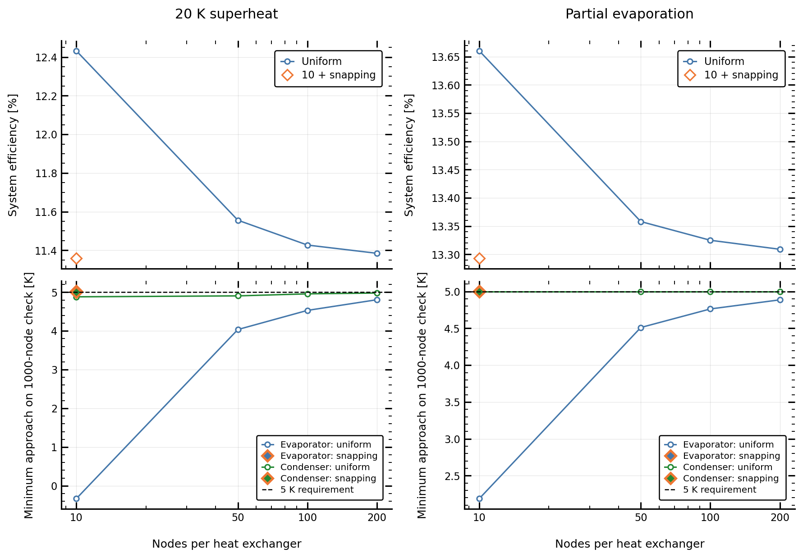
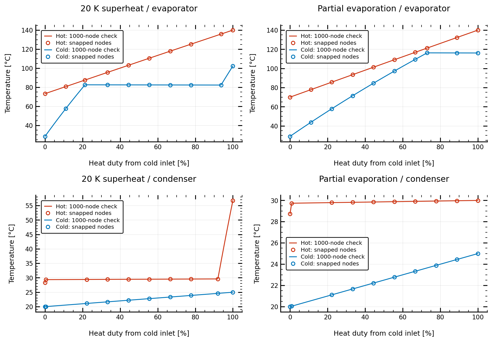

# Heat-exchanger node snapping

Optimize a simple cyclopentane Rankine cycle with either **20 K turbine-inlet superheat** or **partial evaporation**. Compare uniform heat-exchanger grids with a coarse grid that snaps nodes to the liquid/vapor saturation boundaries.

## Run

From the repository root, with ThermoOpt and its dependencies installed:

```console
python examples/demo_hx_node_snap/run_demo.py
```

`case.yaml` contains the cycle, solver settings, initial guesses and inlet constraints. Edit `UNIFORM_NODES`, `SNAP_NODES` or `CHECK_NODES` at the top of `run_demo.py` to change the comparison. Each run performs all optimizations again and updates this README and the figures.

Enable snapping on both heat exchangers using:

```yaml
heater:
  num_elements: 10
  include_saturation_nodes: true
cooler:
  num_elements: 10
  include_saturation_nodes: true
```

These entries belong under `problem_formulation.fixed_parameters`. Set `include_saturation_nodes: false` for the unchanged uniform calculation. Snapping moves the interior two-phase nodes next to saturation boundaries and adjusts the opposite stream at the same heat duty. It preserves endpoints and node counts, and uses a linear pressure estimate without an iterative root finder.

## Results

The heat source is water at 140 °C and 10 bar, with a 70 °C minimum outlet; cooling water enters at 20 °C and leaves at approximately 25 °C. Turbine efficiency is 90%, pump efficiencies are 70%, pressure losses are 1% per HX stream, and minimum approach is 5 K. Net cycle output is 1 MW before the external-water pumps. System efficiency includes those pumps and references source heat available down to 70 °C.

All 10 cases start from the same YAML guess within each inlet formulation and use the same SLSQP settings. Each final design is independently reevaluated with **1000 uniform nodes and snapping disabled**, without reoptimization. 10/10 optimizations converged and satisfied their sampled constraints.

| Inlet case | HX grid | System efficiency [%] | Evaporator check [K] | Condenser check [K] | Solve time [s] |
|---|---|---:|---:|---:|---:|
| 20 K superheat | 10 uniform | 12.4321 | -0.3317 | 4.8816 | 17.11 |
| 20 K superheat | 50 uniform | 11.5558 | 4.0362 | 4.9055 | 24.20 |
| 20 K superheat | 100 uniform | 11.4272 | 4.5305 | 4.9582 | 37.29 |
| 20 K superheat | 200 uniform | 11.3845 | 4.8063 | 4.9794 | 53.71 |
| 20 K superheat | 10 + snap | 11.3587 | 5.0269 | 5.0014 | 42.93 |
| Partial evaporation | 10 uniform | 13.6603 | 2.1890 | 5.0000 | 10.71 |
| Partial evaporation | 50 uniform | 13.3581 | 4.5115 | 5.0000 | 10.66 |
| Partial evaporation | 100 uniform | 13.3250 | 4.7635 | 5.0000 | 15.25 |
| Partial evaporation | 200 uniform | 13.3091 | 4.8871 | 5.0000 | 36.01 |
| Partial evaporation | 10 + snap | 13.2932 | 5.0045 | 5.0000 | 18.19 |



- **20 K superheat:** 10 snapped nodes give 11.3587% efficiency versus 11.3845% with 200 uniform nodes; the snapped design's evaporator/condenser checks are 5.0269/5.0014 K.
- **Partial evaporation:** 10 snapped nodes give 13.2932% efficiency versus 13.3091% with 200 uniform nodes; the snapped design's evaporator/condenser checks are 5.0045/5.0000 K. Its optimized turbine-inlet vapor fraction is 20.2%.

A coarse uniform grid can miss a sharp pinch and therefore report optimistic efficiency. Judge efficiency together with the independent approach-temperature checks, not by objective agreement alone. Snapping places the few available nodes at the phase boundaries where these pinches occur.



The circles are the snapped model nodes; the lines reevaluate the same optimized designs on the uniform check grid. A finite check grid can still miss an exact corner. Pressure location is approximate with pressure loss, and a grid must contain interior two-phase nodes to snap them. These are single-start local optimizations; solve times exclude checks and plotting and are not a controlled speed benchmark.

## Files

- `case.yaml`: all cycle and solver inputs, including both inlet formulations.
- `run_demo.py`: optimization, node sensitivity, independent checks and report generation.
- `results/`: per-case input/solution YAML, solver records, model/check profiles, and `summary.csv` (ignored by Git).
- `figures/`: the PNG figures above and matching PDFs, retained in Git.
